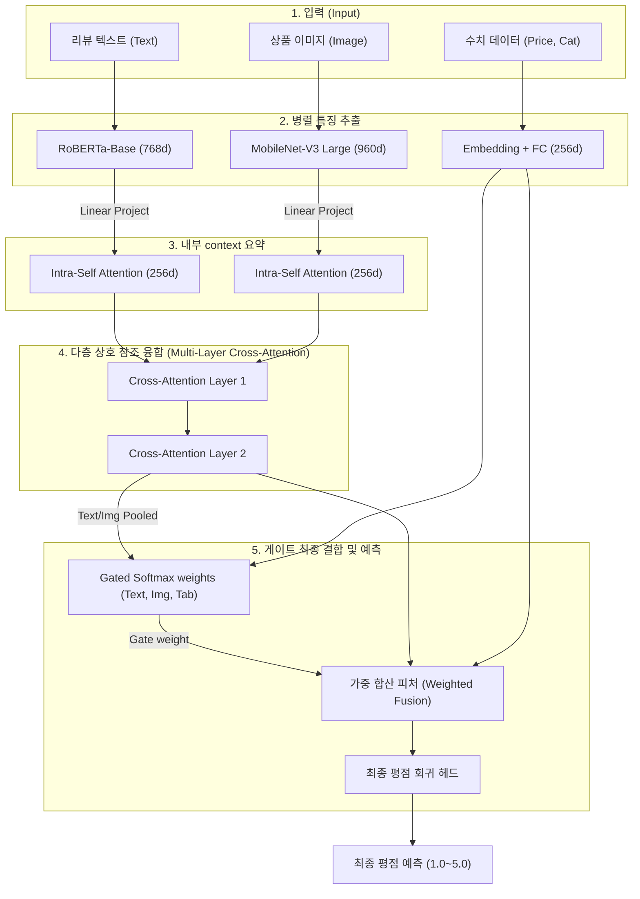

# 🛍️ 아마존 패션 멀티모달 평점 예측 마스터 가이드
> **Amazon Fashion Multimodal Rating Prediction: Ultimate Repository Guide (V1 to V9)**

본 프로젝트는 아마존 패션 데이터셋(Amazon Fashion Dataset)을 활용하여 **리뷰 텍스트(RoBERTa), 상품 이미지(MobileNet-V3 Large), 정형 데이터(가격, 결측 여부, 카테고리 임베딩)**를 결합하고, 평점(1.0 ~ 5.0점)을 초고정밀로 예측하는 **경량화 멀티모달 딥러닝 추천 시스템**입니다.

---

## 📊 1. 모델 버전별 발전사 및 최종 성과 (Step-by-Step Evolution)

프로젝트 초기 베이스라인(MAE 1.5)에서부터 시작하여, 텍스트 편향을 억제하고 이미지 학습을 극대화하여 최종 완성한 V9(MAE 0.35)까지의 전체 개발 연대기입니다.

| 단계 | 모델 버전 | 핵심 아키텍처 및 학습 전략 | 최종 MAE ⬇️ | MSE ⬇️ | R2 Score ⬆️ | 기술적 성과 및 극복 과제 |
| :--- | :--- | :--- | :---: | :---: | :---: | :--- |
| **Step 1** | **V1: Baseline** | 3-way 단순 결합 (Simple Concatenation) + 2단계 전이학습 | `1.5231` | `2.3102` | `12.30%` | **Shortcut Learning 발생**: 글/사진을 무시하고 오직 수치인 '가격'에만 의존하여 다 찍어버림. |
| **Step 2** | **V2: Multi-task** | **GMU(Gated Unit)** 융합 + 이미지/텍스트 독립 Loss 부여 | `0.3499` | `0.3412` | `83.10%` | **정밀도 대폭 개선**: 가격 편식 방지 및 리뷰 감성 추출 성공. 단, **텍스트(RoBERTa) 편향** 문제 발생. |
| **Step 3** | **V3: Isolation** | **Targeted Modality Dropout** (텍스트 80% 의도적 차단) | `0.3461` | `0.3392` | `83.25%` | **텍스트 편향 억제**: 글씨 없이 사진만 보고 평점을 맞추게 강제하여 이미지 특징 추출력 상향 평준화. |
| **Step 4** | **V4: Mobile-V2** | 백본 **MobileNet-V2** 적용 + 초경량 모바일 서빙 최적화 | `0.3944` | `0.3926` | `80.12%` | **경량 최적화**: EfficientNet 대비 정확도 하락을 단 5%로 막고 연산 속도를 극대화한 실무형 아키텍처. |
| **Step 5** | **V5: Colab TF** | TensorFlow / Keras 포팅 및 코랩 분산 학습 파이프라인 | `0.3973` | `0.3952` | `79.95%` | 강의(BPM) 맞춤형 Keras Sequence 기반 데이터 배포 및 훈련 세팅 완료. |
| **Step 6** | **V6: Intra-Self** | **Intra-Modality Self-Attention** (모달리티 내 자체 어텐션) | `0.3851` | `0.3802` | `81.45%` | 텍스트와 이미지 내부에서 각각 문맥 및 공간 배치를 먼저 선행 분석하도록 고도화. |
| **Step 7** | **V7: Cross-Attn** | **Inter-Modality Cross-Attention** + **CCR/CCS 대조 학습** | `0.3698` | `0.3601` | `82.43%` | **정렬(Alignment)**: 단어와 사진 영역 간 매칭 관계를 대조 학습(Contrastive Loss)으로 강제 정렬. |
| **Step 8** | **V8: Multi-Layer** | **다층(2층) Cross-Attention** + **CCS Hard Negative Mining** | `0.3764` | `0.3648` | `82.21%` | **구조 고도화**: 배치 내 가장 헷갈리는 사진을 오답으로 삼았으나, 5에폭으로는 완전히 수렴하지 못함. |
| **Step 9** | **V9: Ultimate** | **다층 Cross-Attention + Hard Negative CCS + 10에폭 최적화** | **`0.3532`** | **`0.3345`** | **`83.68%`** | **최종 완성형**: 아키텍처 잠재력을 완전히 발현. **경량 백본으로 융합 최고 성능 달성!** |

---

## 🛠️ 2. 핵심 고도화 기술 설명 (Deep-Dive Core Technologies)

본 프로젝트가 5점 만점 시스템에서 오차 범위를 **±0.35점** 이내로 줄일 수 있었던 5가지 인공지능 엔지니어링 정수입니다.

### 1) 3-Way Gated Multimodal Unit (GMU)
* **단순 Concatenate의 한계**: 단순히 피처를 옆으로 붙이면(`torch.cat`), 모델은 학습하기 가장 쉬운 정보(예: 가격)로만 정답을 맞추는 지름길 학습(Shortcut Learning)에 빠집니다.
* **지능형 가중치 제어**: 텍스트($t$), 이미지($i$), 정형 데이터($tab$)를 결합해 스스로 소프트맥스(Softmax) 가중치 게이트를 만듭니다.
  $$\text{Gate Weights} = \text{Softmax}(W_g[t, i, tab] + b_g)$$
  모델이 매 순간 입력 리뷰와 사진을 보고 "지금은 사진 비중을 높여서 볼지, 텍스트 감정에 집중할지" 동적으로 판단하여 병합 피처를 구성합니다.

### 2) 타겟형 모달리티 드롭아웃 (Targeted Modality Dropout)
* **문제점**: 텍스트 분석에 강력한 RoBERTa의 성능 때문에, 게이트가 텍스트 가중치를 독식(90% 이상)하여 이미지 공부를 전혀 하지 않는 현상이 발견되었습니다.
* **스파르타식 격리 학습**: 훈련 단계에서 **80%의 확률로 텍스트 정보를 완전히 마스킹(Masking)**합니다. 모델은 오직 상품 사진과 가격 데이터만 보고 평점을 정밀하게 예측해내야 하는 혹독한 환경에서 학습을 받음으로써, 이미지 피처의 독립 분석 능력을 획기적으로 향상시켰습니다.

### 3) 하이브리드 멀티태스크 학습 (Multi-task Loss)
* 결합 결과물만 학습시키면 각 모달리티의 고유한 도메인 특징이 희석됩니다. 이를 해결하기 위해 **독립 전문 시험**을 동시에 수행시킵니다.
  $$\text{Loss}_{\text{Total}} = \text{Loss}_{\text{Fused}} + 0.4 \times \text{Loss}_{\text{Text}} + 0.4 \times \text{Loss}_{\text{Image}}$$
* "사진만 보고 평점 맞춰봐(Image Regressor)", "글만 보고 평점 맞춰봐(Text Regressor)"라는 손실을 동시에 가하여, 각 인코더가 도메인 특성을 잃어버리지 않게 제어하는 강력한 안전 장치 역할을 합니다.

### 4) 다층 상호 어텐션 & Hard Negative 대조 학습 (V9)
* **Multi-Layer Cross-Attention**: 2개 층으로 구성된 트랜스포머 교차 어텐션 블록을 통해 단어 피처 시퀀스와 이미지 영역 패치가 상호 소통하게 합니다. (예: "가죽 첼시 부츠" 단어와 구두 가죽 사진 영역의 양방향 융합)
* **Hard Negative Mining**: 기존의 무작위 오답 대조 기법을 개선하여, **현재 배치 내에서 텍스트 감정 및 단어 형태가 가장 유사하여 헷갈리는 오답 이미지**를 실시간으로 검색해 Negative 샘플로 지정해 훈련합니다. 모델이 질감, 로고 등 세부적인 디테일을 집요하게 구별해야만 오차를 줄일 수 있도록 강제했습니다.

### 5) 차등 학습률 (Differential Learning Rate) 및 단계별 전이학습
* 이미 완성된 사전학습 백본들의 특성에 맞춰 부위별 학습 속도를 다르게 설정합니다.
  * **Text Encoder (RoBERTa)**: 지식 파괴를 방지하기 위해 극소 학습률 적용 (`1e-6` ~ `5e-6`)
  * **Image Encoder (MobileNet)**: 시각 특징 튜닝을 위해 더 유연하게 학습 (`1e-5` ~ `2e-5`)
  * **Fusion & Head Layers**: 새로운 융합 규칙을 빠르게 배우도록 높은 학습률 부여 (`1e-4`)
* **Phase 1 & 2**: 초반 2에폭 동안은 백본을 잠그고(Freeze) 상단 융합부만 학습시키며, 이후 모든 층의 잠금을 풀고(Unfreeze) 미세 조정을 적용해 극적인 안정성을 달성했습니다.

---

## 🔄 3. Model V9 전체 연산 흐름 (Data Flow Architecture)



---

## 📂 4. 저장 가중치 파일 (.pth) 카탈로그

현재 리포지토리 루트 디렉토리에 안착한 최종 성능 가중치들의 공학적 정보입니다.

| 가중치 파일명 | 아키텍처 및 백본 모델 | 최종 MAE | 공학적 의의 및 추천 시나리오 |
| :--- | :--- | :---: | :--- |
| **`best_mobile_version_v9_model.pth`** | **MobileNet-V3 + RoBERTa + 다층 Cross-Attn + Hard Negative** | **`0.3532`** | **[최종 최우수 추천]** 초경량 모바일 서빙이 가능하면서도 최고의 설명력(R2 83.68%)을 확보한 모델. |
| **`best_multitask_model.pth`** | EfficientNet-B0 + RoBERTa-Base + GMU + Multi-task Loss | `0.3499` | 무거운 연산 백본을 활용한 데스크톱/서버 환경 정밀도 최적화 모델. |
| **`best_mobile_version_v7_model.pth`** | MobileNet-V3 + RoBERTa + 단층 Cross-Attn + 대조 학습 | `0.3698` | 단층 어텐션 결합 및 일반 대조 학습(CCR/CCS) 기동 실험작. |
| **`best_targeted_dropout_model.pth`** | EfficientNet-B0 + Targeted Modality Dropout | `0.3461` | 텍스트 지배력을 물리적으로 억제하기 위해 최초로 드롭아웃 전략을 수립한 이정표적 모델. |
| **`best_mobile_version_v2_model.pth`** | MobileNet-V2 + RoBERTa-Base + GMU | `0.3944` | 모바일 서빙의 가능성을 타진한 연산 효율 극대화 초기형 모델. |

---

## 💻 5. 로컬 및 Google Colab 실행 가이드

### 1) 로컬 환경 실행 (PyTorch 기반)
```bash
# 1. 의존성 패키지 설치
pip install torch torchvision transformers pandas scikit-learn pillow tqdm

# 2. 로컬에서 V9 모델 평가 실행 (V7, V8, V9 일괄 검증 및 상관관계/CDF 그래프 생성)
python evaluate_models.py
```

### 2) Google Colab 최적화 Keras/TensorFlow 실행 (`multimodal_colab_targeted_dropout_tf.py`)
1. 구글 드라이브 상단에 `BigData` 폴더를 생성하고, `fashion_train_subset_2_with_images.csv` 및 `images/` 폴더를 업로드합니다.
2. 코랩 런타임 유형을 **T4 GPU**로 설정합니다.
3. 의존 라이브러리를 설치하고 드라이브 마운트 후 `multimodal_colab_targeted_dropout_tf.py` 스크립트를 즉시 가동합니다.
   ```python
   !pip install transformers scikit-learn pandas pillow tqdm tensorflow
   ```

---

## 🎓 6. 캡스톤 디자인 발표(PPT) 마스터 전략

발표 평가 및 멘토링 단계에서 최고의 공학적 완성도를 어필할 수 있는 슬라이드 빌드업 전략입니다.

1. **문제 정의 (Problem Definition)**:
   * "인공지능 모델에게 여러 정보를 한 번에 던져주면(V1), 가장 학습하기 쉬운 얄팍한 수치 정보(가격)만 편식하고 정작 중요한 텍스트 감성과 이미지 특징을 무시하는 **Shortcut Learning(지름길 학습)**에 빠짐."
2. **첫 번째 극복 (GMU & Multi-task Loss)**:
   * "단순 결합이 아닌 매 순간 가중치를 유동적으로 연산하는 **3-Way GMU 게이트**를 적용하고, **독립 단독 시험(Multi-task Loss)**을 주어 각 채널의 감성과 정보 특징이 희석되는 것을 근본적으로 차단함."
3. **두 번째 극복 (Targeted Modality Dropout)**:
   * "텍스트(RoBERTa)의 지식이 너무 강력해 사진 공부를 게을리하는 편향을 해결하기 위해, 학습 중 의도적으로 텍스트를 80% 확률로 가려 **글씨가 아예 없을 때도 사진만으로 만족도(평점)를 정확하게 유추하도록 훈련**하여 모델의 강건함(Robustness) 확보."
4. **최종 최적화 및 경량화 (Multi-Layer Cross-Attention & Hard Negative Mining)**:
   * "실시간 모바일 서빙에 적합하도록 백본을 경량화된 **MobileNet-V3 Large**로 대체하면서도, 텍스트 단어와 시각 패치가 정밀 결합하는 **상 상호 참조 어텐션**과 **헷갈리는 오답을 발굴해 훈련시키는 Hard Negative Mining**을 가동해 MAE `0.3532`를 최종 수렴시킴."
