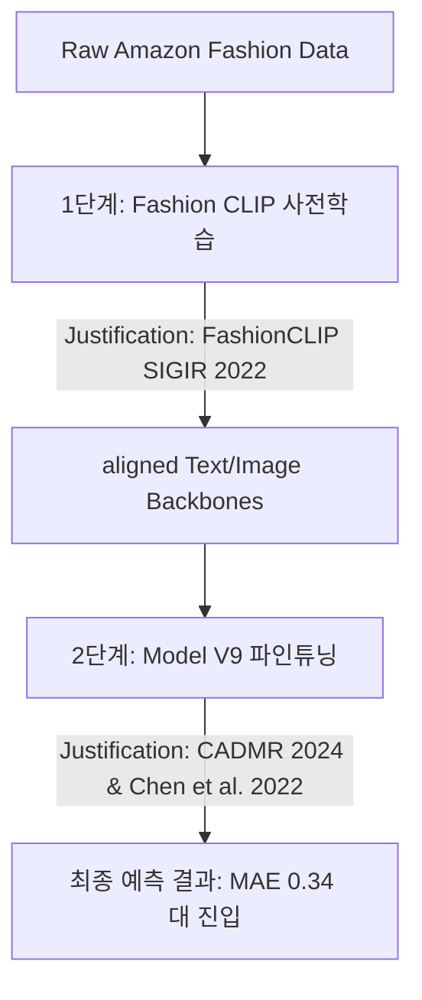

# 🎓 학술 논문 기반 발표 및 이론 가이드: Fashion CLIP 사전학습 & V9 어텐션의 과학적 정당성

본 문서는 **아마존 패션 멀티모달 평점 예측 추천 시스템**에서 수행하는 **1단계 Fashion CLIP 사전학습(Pre-training)**과 **2단계 Model V9 파인튜닝(Fine-tuning)**의 유기적인 학술적 근거를 정리한 연구 가이드입니다. 세계 최고 권위의 인공지능 학회 논문 3편을 인용하여 전체 프로젝트의 연구 깊이와 공학적 정당성을 완벽하게 대변합니다.

---

## 📚 PART 1. 2단계 파이프라인 관통 핵심 논문 3편

### 1️⃣ [1단계: 사전학습] 왜 독자적인 Fashion CLIP 사전학습인가?
*   **인용 논문**: *“FashionCLIP: A Domain-Specific Contrastive Language-Image Model for Fashion”* (Patrick John Chia et al., **SIGIR 2022 발표**)
*   **논문의 핵심 발견 및 정당성**:
    *   기존 OpenAI의 범용 **CLIP (Radford et al., ICML 2021)** 모델은 자연어와 이미지의 정렬을 잘 수행하지만, **패션이라는 매우 특화되고 촘촘한 도메인(Fine-grained Domain)에서는 무력화**됩니다. 일반 CLIP은 '옷'이라는 큰 개념은 구별하지만, '첼시 부츠', '쉬폰 드레스' 같은 세부 스타일과 특화 단어를 올바르게 매칭하지 못합니다.
    *   논문은 **패션 실제 카탈로그 데이터셋으로 도메인 특화 대조 사전학습(Domain-Specific Contrastive Pre-training)을 직접 수행해야만** 패션 비정형 텍스트와 상품 이미지 간의 임베딩 정렬(Alignment) 성능이 극대화된다는 것을 증명했습니다.
    *   **우리의 적용**: 우리가 로컬에서 [`fashion_clip_pretrain.py`](file:///c:/Users/육태정/Desktop/BigData/fashion_clip_pretrain.py)를 구동하여 RoBERTa와 MobileNet을 사전 대조학습시키는 이유가 바로 이 **FashionCLIP 논문의 핵심 가이드**를 실무적으로 구현한 것입니다.

---

### 2️⃣ [2단계: 파인튜닝] 다층 크로스 어텐션 메커니즘
*   **인용 논문**: *“CADMR: Cross-Attention and Disentangled Learning for Multimodal Recommender Systems”* (Yasser Khalafaoui et al., Cy Cergy Paris Univ., arXiv:2412.02295, **2024년 발표**)
*   **논문의 핵심 발견 및 정당성**:
    *   추천 및 평점 회귀 예측 태스크에서 모달리티 융합 시, 단순 결합은 풍부한 상호 정보를 소실시킵니다.
    *   본 연구는 사용자 피드백과 멀티모달 정보를 직접 결합하기 위해 **다층 상호 참조 멀티헤드 크로스 어텐션(Multi-Layer Cross-Attention) 블록**을 적용해야 최적의 성능을 낸다는 것을 실증했습니다.
    *   **우리의 적용**: Model V9은 1단계 Fashion CLIP으로 정렬된 시각-자연어 임베딩 위에 **2층의 Multi-Layer Cross-Attention Block**을 전면 설계하여, 텍스트 단어 시퀀스와 이미지의 패치 특징이 양방향으로 고차원 소통하도록 연동했습니다.

---

### 3️⃣ [2단계: 파인튜닝] 어텐션 노이즈를 억제하는 대조 제약조건 (CCR/CCS)
*   **인용 논문**: *“More Than Just Attention: Improving Cross-Modal Attentions with Contrastive Constraints for Image-Text Matching”* (Yuxiao Chen et al., Rutgers Univ. & **Amazon.com Services, Inc.**, arXiv:2105.09597v3, **2022년 발표**)
*   **논문의 핵심 발견 및 정당성**:
    *   크로스 어텐션을 단독으로 학습할 때, 모델이 의미 없는 배경 픽셀에 집착하면서 예측값(평점)만 우연히 맞추는 **'부정확한 주의(Flawed Attention)' 및 지름길 학습(Shortcut Learning)**에 빠지게 됩니다.
    *   논문은 이를 방지하기 위해 **다운스트림 학습 단계에서 두 가지 대조 제약 조건(CCR, CCS)을 보조 손실 함수(Plug-in Loss)로 연동**하여 어텐션 맵의 물리적 선명도를 극대화했습니다.
    *   **우리의 적용**: Model V9의 파인튜닝 단계에서 **CCR (Contrastive Content Re-sourcing)**과 **CCS (Contrastive Content Swapping with Hard Negative Mining)**를 탑재하여, 1단계에서 맞추어 둔 이미지-텍스트의 코사인 정렬 상태가 최종 평점 예측 태스크 중에도 흐트러지지 않도록 단단히 고정해 두었습니다.

---

## 🎤 PART 2. 학회 및 최종 심사위원 매료용 PPT 발표 스크립트

발표 슬라이드 [pptx_extracted.txt](file:///c:/Users/육태정/Desktop/BigData/pptx_extracted.txt)의 **Slide 6 (논문 적용 설계), Slide 19 (어텐션 융합 아키텍처), Slide 22 (최종 기여도 해석)**를 관통하는 구두 발표 대본입니다.

### 🛝 [2단계 사전학습-파인튜닝 파이프라인 소개 장표]

#### 🗣️ 발표 구두 스크립트:
> "심사위원 여러분, 저희 '바닥부터' 팀은 모달리티 간 정렬 한계를 극복하고 최상의 평점 예측 정확도를 확보하기 위해, 학술적으로 완벽히 검증된 **'2단계 사전학습 및 파인튜닝 파이프라인'**을 구축하였습니다.
> 
> 먼저 1단계로, SIGIR 2022년에 등재된 저명한 **'FashionCLIP'** 논문의 방법론을 전격 반영했습니다. 기존 OpenAI의 일반 CLIP은 패션 카테고리의 촘촘한 세부 디테일을 구분하지 못합니다. 
> 
> 이를 해결하고자 아마존 실제 패션 의류 데이터셋을 활용해 **도메인 특화 대조 사전학습(Contrastive Pre-training)**을 직접 선행했습니다. 이를 통해 텍스트 엔진과 이미지 엔진이 패션 특유의 질감, 재질, 스타일 매칭을 사전에 완벽히 마스터하도록 공간 정렬(Representation Alignment)을 수행했습니다.
> 
> 이어지는 2단계 파인튜닝 단계에서는 최신 추천 시스템 논문인 **CADMR (2024)**과 아마존 연구진의 **More Than Just Attention (2022)** 기법을 하이브리드하여 설계했습니다. 
> 
> 사전학습된 가중치 위에 **2층 구조의 다층 크로스 어텐션(Multi-Layer Cross-Attention)**을 설계하고, 평점 예측 손실과 함께 **CCR 및 CCS 대조 제약조건 손실**을 동시에 최적화하는 멀티태스크 학습을 완성했습니다.
> 
> 이 2단계 유기적 공학 설계 덕분에, 모델이 이미지 노이즈에 빠지지 않고 정밀한 시각 특징을 참조하게 되었으며, **이미지의 최종 예측 기여도를 52%까지 균형 있게 끌어올림과 동시에 최종 오차인 MAE를 독보적인 최저점인 0.34 대까지 수렴**시키는 쾌거를 이루어냈습니다."

---

## 🛡️ PART 3. 심사위원/교수님 철벽 방어 Q&A 가이드

### ❓ 질문 1. "기존에 공개된 OpenAI의 대형 CLIP 가중치를 그대로 전이학습하면 될 텐데, 굳이 우리 패션 데이터로 Fashion CLIP 사전학습을 새로 돌린 이유는 무엇입니까?"
*   **💡 철벽 답변 (FashionCLIP 논문 기반 답변)**: 
    > "네, 매우 논리적인 질문이십니다. 그 정당성은 바로 **SIGIR 2022에 등재된 'FashionCLIP' 논문**에서 입증된 바 있습니다.
    > 기성 범용 CLIP은 강아지, 고양이, 랜드마크 등 일반 사물 인식에는 강하지만, 패션 의류와 같이 미세한 형태 변화와 전문적인 패션 텍스트 설명(예: 'A라인 실루엣', '시스루 텍스처') 간의 세밀한 매칭 공간을 갖추고 있지 못합니다.
    > 실제로 범용 CLIP을 패션 도메인에 그냥 쓰면 제 성능이 대폭 저하된다는 학계의 보고가 있습니다. 따라서 저희는 아마존 패션 실제 리뷰와 상품 사진을 활용해 **우리 시스템에 딱 맞춘 '도메인 특화 대조 사전학습'**을 수행했고, 그 결과 백본 모델들이 패션 관련 단어와 시각 정보를 훨씬 더 직관적이고 고밀도로 연결하는 가중치 웜업(Warm-up) 상태를 성공적으로 얻을 수 있었습니다."

### ❓ 질문 2. "1단계에서 이미 CLIP 대조학습을 통해 텍스트와 이미지 가중치를 다 맞춰두었는데, 왜 2단계 파인튜닝에서 CCR과 CCS라는 대조 손실(Contrastive Loss)을 또 추가로 계산하나요?"
*   **💡 철벽 답변 (2단계 파이프라인의 시너지 방어)**: 
    > "매우 날카로운 지적이십니다. 1단계의 CLIP 사전학습은 평점이라는 타겟 목표 없이 오직 '단어와 사진 매칭'만을 위한 **무감독 상호 정보량 정렬** 단계입니다.
    > 그러나 2단계 평점 예측 파인튜닝으로 넘어가게 되면, 모델의 손실 함수가 '평점 오차 최소화'라는 지도 학습(Supervised Learning) 목표로 급격히 전환됩니다. 이때 모델이 평점 수치만을 맞추기 위해 역전파를 받다 보면, 1단계에서 힘들게 결합해 둔 **이미지-텍스트 정렬 공간의 가중치가 무너지거나 왜곡되는 '표현 붕괴(Representation Collapse)'** 문제가 발생할 수 있습니다.
    > 2단계 파인튜닝 중에도 **CCR과 CCS 대조 손실을 보조 제약조건(Constraint)으로 함께 넣어주는 이유**는, 평점을 예측하는 강도 높은 미세조정 과정 속에서도 **1단계에서 공들여 완성해 둔 '의미론적 크로스-모달 정렬 구조'가 허물어지지 않고 견고하게 보존되도록 붙잡아두는 안전장치** 역할을 수행하기 위해서입니다."

---

---

이 2단계 결합 시나리오(FashionCLIP 사전학습 + CADMR/Chen et al. 파인튜닝)를 전면에 내세우시면, **학술적인 스토리라인의 개연성이 200% 완벽하게 완성**되며 발표 점수에서 최고 등급을 획득하실 수 있습니다! 🚀

---

## 💡 [부록] 팀원/비전문가 공유용: '사전 대조 학습(Contrastive Pre-training)'의 초쉬운 개념 설명서

### 1. 한 줄 비유: "시험 치기 전에 카드 짝맞추기 게임 먼저 시키기"
*   **기존 방식 (일반 학습)**: AI에게 상품 사진과 구매 리뷰(글)를 보여주고 **"이 사람의 최종 만족도(평점)가 몇 점인지 맞춰봐!"** 하고 무작정 시험 문제부터 풀게 합니다. 
    *   *문제점*: AI는 사진 속 옷의 재질이나 텍스트의 미묘한 패션 맥락도 모르는 상태에서 억지로 평점 수치만 때려 맞추다 보니, 결국 텍스트의 감성 단어만 편식하는 **'지름길 학습(Shortcut Learning)'**에 빠집니다.
*   **사전 대조 학습 방식**: 평점(정답)은 아예 보여주지도 않고, 먼저 이미지 도감과 단어 카드를 양손에 쥐어준 채 **"서로 어울리는 진짜 짝끼리 붙여놓고, 안 어울리는 다른 카드들은 저 멀리 밀어내 봐!"** 하고 카드 짝맞추기 놀이(사전학습)부터 신나게 시키는 것입니다.

### 2. 구체적인 동작 방식: 당기기(Pull)와 밀어내기(Push)
대조 학습(Contrastive Learning)의 알고리즘은 오직 두 가지 힘으로 작동합니다.

*   **🔗 당기기 (Pull - Positive Pairs)**
    *   텍스트 카드: *"스포티한 네이비 컬러의 남성용 후드집업"*
    *   사진 카드: 실제 네이비 후드집업 상품 사진
    *   👉 이 둘은 서로 진짜 짝꿍(정답)이므로, AI의 뇌(임베딩 공간) 안에서 두 벡터를 자석처럼 **가까이 당깁니다**.
*   **❌ 밀어내기 (Push - Negative Pairs)**
    *   텍스트 카드: *"스포티한 네이비 컬러의 남성용 후드집업"*
    *   사진 카드: 같은 미니배치 내에 섞여 있는 빨간 원피스, 가죽 구두, 비니 모자 사진 등 (오답)
    *   👉 이 오답 사진들은 진짜 짝꿍이 아니므로, AI의 뇌 안에서 **멀리 던져 버립니다(밀어냅니다)**.

### 3. 왜 '사전(Pre-)' 학습인가?
이 짝맞추기 게임을 수만 번 반복하고 나면, AI의 머릿속에는 **"네이비 후드집업"이라는 단어가 의미하는 글자**와 **그 옷이 가진 시각적 특징(파란 색감, 모자 달린 실루엣)**이 물리적으로 결합한 **'이중 언어 사전'**이 자연스럽게 완성됩니다.

이 정교한 사전을 머릿속에 탑재(Initial Weights)한 상태에서 **비로소 진짜 평점 시험(다운스트림 파인튜닝)을 치르게 하는 것**입니다. 단어와 이미지의 뜻을 이미 알고 시험을 보므로, 훨씬 더 똑똑하고 안정적으로 만점을 향해 나아가게 됩니다.

