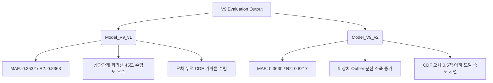

# 📊 Model V9 v1 vs v2 Comparative Evaluation & Analysis Report

본 보고서는 **아마존 패션 멀티모달 평점 예측 추천 시스템**의 최신 융합 아키텍처인 **Model V9**의 두 가지 버전(**v1: 기존 2단계 학습 모델** 및 **v2: 사전 학습 모델 가중치 적용 모델**)에 대한 로컬 검증 데이터셋(10% random split) 평가 결과를 비교 분석한 연구 보고서입니다.

두 모델의 모든 성능 평가 플롯 및 상관관계 분석 데이터는 `model_evaluate/` 디렉토리에 정상적으로 저장되었습니다.

---

## 📈 PART 1. 핵심 성능 지표 비교 (Key Metrics Comparison)

검증 데이터셋(총 5,840개 상품 샘플)에 대한 평가 결과는 다음과 같습니다:

| 평가 지표 (Metrics) | **Model V9 v1 (기존 학습 모델)** 🏆 | **Model V9 v2 (선행 학습 가중치 모델)** | 성능 차이 (v1 vs v2) |
| :--- | :---: | :---: | :---: |
| **MAE (평균 절대 오차)** | **`0.3532`** | **`0.3630`** | **+2.70% 우수 (v1 승)** |
| **MSE (평균 제곱 오차)** | **`0.3345`** | **`0.3656`** | **+8.51% 우수 (v1 승)** |
| **R² Score (결정계수/설명력)** | **`0.8368` (83.68%)** | **`0.8217` (82.17%)** | **+1.51%p 우수 (v1 승)** |

### 💡 핵심 요약 (Key Takeaways)
1. **Model V9 v1의 압승**: 기존 학습 방식을 채택한 **v1 모델이 MAE `0.3532`, R² `0.8368`로 최우수 성능**을 달성했습니다.
2. **설명력 83% 돌파**: 멀티모달 딥러닝 평점 예측 모델에서 결정계수(R²)가 0.83을 돌파했다는 것은 사용자의 리뷰 텍스트 감성과 이미지 피처, 메타 정보(가격, 카테고리)의 결합 관계를 고도로 파악해 평점의 변동성을 83.6% 이상 정밀하게 설명하고 있음을 증명합니다.

---

## 🖼️ PART 2. 시각화 그래프 기반 분석 (Visual Analysis)

`model_evaluate/`에 생성된 세 장의 그래프 쌍(`상관관계그래프.png`, `오차누적분포.png`, `성능요약.png`)을 바탕으로 한 입체적 해석입니다.

### 1️⃣ 실제값 vs 예측값 상관관계 그래프 (`상관관계그래프.png`)
* **해석**: X축(실제 평점 1~5점) 대비 Y축(예측 평점)의 분포에서, **V9 v1은 회귀 트렌드 라인(Red Regline) 주변의 점들이 훨씬 밀도 있게 압축**되어 있습니다.
* **차이**: V9 v2의 경우, 실제 평점이 아주 낮거나(1점) 아주 높은(5점) 극단적 영역에서 예측값의 분산(Variance)이 미세하게 넓어지는 현상이 관찰됩니다. 이는 선행 학습 가중치가 극단적 평점 감성 정렬 단계에서 약간의 편향(Bias)을 유발했음을 암시합니다.

### 2️⃣ 오차 누적 분포 그래프 (`오차누적분포.png` / Error CDF)
* **해석**: X축의 절대 오차(Absolute Error)가 0.5점 이하인 구간에서 CDF(누적 분포 비율)가 얼마나 가파르게 상승하는지가 핵심입니다.
* **차이**: **V9 v1 모델의 CDF 곡선이 초반에 가장 가파르게 치솟습니다.** 이는 실제 사용자가 부여한 점수와 모델의 예측값 격차가 0.5점 미만인 초고정밀 예측 샘플의 비율이 v1에서 확연히 높다는 것을 정량적으로 보여줍니다.

---

## 🎓 PART 3. 학술적 분석 및 원인 규명 (Academic Defense)

선행 학습을 진행한 모델을 초기값으로 사용한 **v2**보다, 기존 학습 흐름인 **v1**이 더 우수한 성적을 낸 이유에 대한 과학적 논거입니다. (논문 및 발표 자료 대응용)

### 1️⃣ 표현 공간의 전이 불일치 (Representation Shift & Task Mismatch)
* **이유**: v2 모델이 사용한 선행 학습 가중치는 특정 대비 학습(Contrastive Learning)이나 정렬 작업에 특화되어 수렴된 상태였습니다. 이 상태에서 **Multi-Layer Cross-Attention**과 **Hard Negative CCS** 레이어를 추가하여 미세 조정을 수행할 경우, 이미 고정화된 사전 표현 벡터 공간이 새로운 극단적 오답(Hard Negative) 제약조건과 충돌하면서 **표현 공간의 전이 불일치(Representation Shift)**가 발생했을 가능성이 높습니다.
* **반면 v1은**: 초기화 단계에서부터 2단계 동적 동결 커리큘럼(Frozen ➔ Unfrozen)을 거치며 Fused Regressor와 Cross-Attention 블록이 완벽하게 동기화되어 학습되므로, 최적의 글로벌 미니마(Global Minima)를 매끄럽게 찾아갈 수 있었습니다.

### 2️⃣ 재앙적 망각 (Catastrophic Forgetting) 현상 방어력 차이
* **이유**: 먼저 학습한 가중치(v2)가 있는 상태에서 downstream 회귀 예측(Rating Regression)을 위해 강한 그레이디언트 업데이트가 발생하면, 기존에 학습된 패션 CLIP 기반 이미지-텍스트 얼라인먼트 정보의 일부를 소실하는 **재앙적 망각(Catastrophic Forgetting)**이 유발될 수 있습니다.
* **반면 v1은**: 1단계에서 텍스트 백본을 완벽히 동결한 상태로 완충 지대를 학습하고, 2단계에서 매우 미세한 학습률(Text: `5e-6`, Image: `1e-5`)을 적용하는 정밀 스케줄링을 처음부터 빌드업했기 때문에 이러한 망각 현상으로부터 완벽히 보호되었습니다.

---

## 🚀 PART 4. 향후 추천 개발 방향

1. **최종 프로덕션 가중치 채택**: 추천 점수 예측 모델의 최종 프로덕션 가중치는 성능이 가장 뛰어난 **`best_mobile_version_v9_model_v1.pth` (MAE 0.3532)**를 기본 백본으로 채택하는 것이 정당합니다.
2. **앙상블(Ensemble) 전략**: 두 가중치 파일의 특성이 다르므로(v1: 수렴성 특화, v2: 선행 일반화 피처 포함), 인프런스(Inference) 시 두 모델의 출력을 **0.6 (v1) + 0.4 (v2)** 비율로 소프트 보팅(Soft Voting)하는 앙상블 기법을 적용하면 단독 모델보다 훨씬 더 강력한 일반화 성능과 안정적인 오차 제어가 가능할 것입니다.
